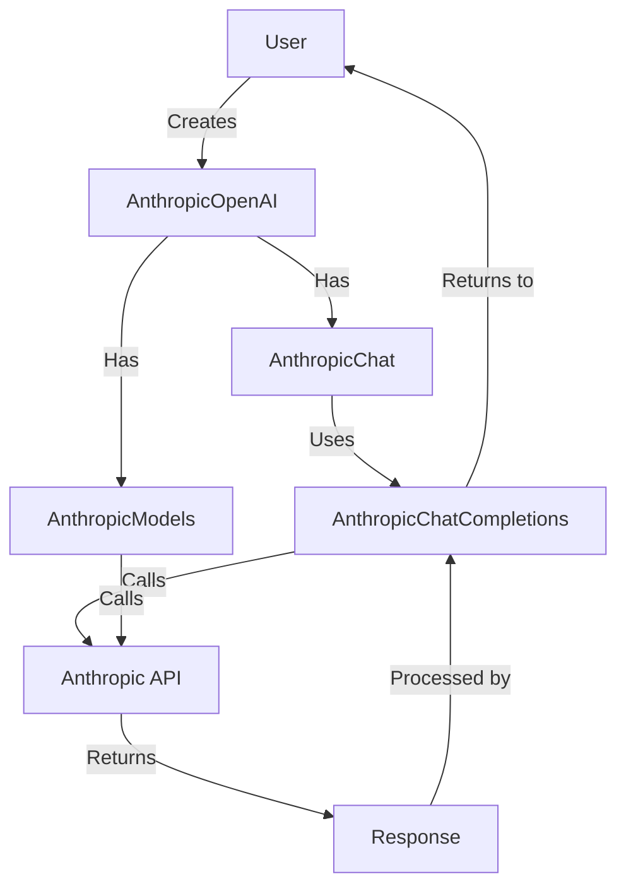

# `languru.openai_plugins.clients.anthropic`

## Overview

The `languru.openai_plugins.clients.anthropic` module is designed to provide an OpenAI-compatible interface for Anthropic's API. It allows users to interact with Anthropic's language models using a familiar OpenAI-style
API, facilitating easy integration and migration between the two services.

## Key Components

1. `AnthropicChatCompletions`
2. `AnthropicChat`
3. `AnthropicModels`
4. `AnthropicOpenAI`

## Detailed Component Descriptions

### AnthropicChatCompletions

This class is responsible for handling chat completions using Anthropic's API. It provides methods for both streaming and non-streaming chat completions.

#### Key Methods

- `create()`: Creates chat completions
- `_create()`: Internal method for non-streaming completions
- `_create_stream()`: Internal method for streaming completions
- `generator_generate_content_chunks()`: Generates content chunks for streaming

#### Usage Example

```python
anthropic_client = AnthropicOpenAI(api_key="your_api_key")
chat_completions = anthropic_client.chat.completions.create(
    messages=[{"role": "user", "content": "Hello, how are you?"}],
    model="claude-2"
)
print(chat_completions.choices[0].message.content)
```

### AnthropicChat

This class serves as a wrapper for `AnthropicChatCompletions`, providing a property to access chat completion functionality.

#### Key Properties

- `completions`: Returns an instance of `AnthropicChatCompletions`

### AnthropicModels

This class handles operations related to Anthropic's language models, such as retrieving model information and listing available models.

#### Key Methods

- `retrieve()`: Retrieves information about a specific model
- `list()`: Lists all available Anthropic models

#### Usage Example

```python
anthropic_client = AnthropicOpenAI(api_key="your_api_key")
models = anthropic_client.models.list()
for model in models:
    print(model.id)
```

### AnthropicOpenAI

This is the main client class that integrates all the functionality for interacting with Anthropic's API using an OpenAI-compatible interface.

#### Key Attributes

- `chat`: Instance of `AnthropicChat`
- `models`: Instance of `AnthropicModels`
- `anthropic_client`: Instance of Anthropic's official client

#### Usage Example

```python
from languru.openai_plugins.clients.anthropic import AnthropicOpenAI

client = AnthropicOpenAI(api_key="your_anthropic_api_key")
response = client.chat.completions.create(
    model="claude-2",
    messages=[
        {"role": "system", "content": "You are a helpful assistant."},
        {"role": "user", "content": "What is the capital of France?"}
    ]
)
print(response.choices[0].message.content)
```

## Dependencies

- `anthropic`: Anthropic's official Python client
- `openai`: OpenAI's Python client (used for type compatibility)
- `httpx`: HTTP client library
- `pydantic`: Data validation and settings management
- `languru.config`: Configuration settings
- `languru.exceptions`: Custom exception classes
- `languru.types.chat.anthropic`: Anthropic-specific chat types
- `languru.types.chat.completions`: General chat completion types
- `languru.types.models`: Model definitions
- `languru.utils.openai_utils`: Utility functions for OpenAI compatibility
- `languru.utils.sse`: Server-Sent Events utilities

## Workflow

The following diagram illustrates the high-level workflow of the `languru.openai_plugins.clients.anthropic` module:



## Performance Considerations

1. Streaming: The module supports both streaming and non-streaming completions. Streaming is recommended for long-running completions to improve responsiveness.
2. Error Handling: The module includes custom error handling to manage API-specific errors and provide meaningful feedback.

## Limitations and Best Practices

1. API Key: Always use environment variables or secure configuration management to store the Anthropic API key.
2. Model Compatibility: Not all OpenAI features have direct equivalents in Anthropic's API. Be aware of potential differences when migrating from OpenAI to Anthropic.
3. Rate Limiting: Be mindful of Anthropic's rate limits and implement appropriate error handling and retries.

## Conclusion

The `languru.openai_plugins.clients.anthropic` module provides a seamless way to integrate Anthropic's powerful language models into projects with an OpenAI-compatible interface. By following the usage examples and best
practices outlined in this documentation, developers can effectively leverage Anthropic's capabilities while maintaining code compatibility with OpenAI-based projects.
