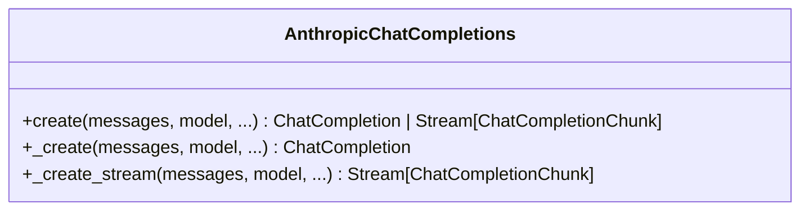
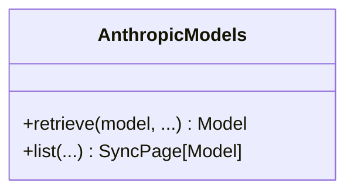
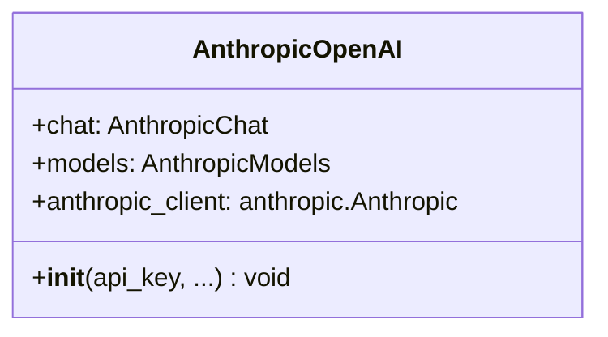

# Anthropic OpenAI

## Introduction

The `languru.openai_plugins.clients.anthropic` module is designed to interact with the Anthropic AI platform, providing functionality for chat completions and model management. This documentation aims to provide a clear and concise overview of the module's functionality, ensuring that developers and users can quickly understand and utilize its capabilities.

## Module Overview

The `languru.openai_plugins.clients.anthropic` module consists of several key components:

- **AnthropicChatCompletions**: Handles chat completion requests and streaming functionalities.
- **AnthropicModels**: Manages model retrieval and listing.
- **AnthropicOpenAI**: The main class that encapsulates the Anthropic client and its functionalities.

### AnthropicChatCompletions



- **create**: Creates a chat completion. It can return either a `ChatCompletion` object or a stream of `ChatCompletionChunk` objects depending on the `stream` parameter.
- **_create**: An internal method that handles the creation of a chat completion without streaming.
- **_create_stream**: An internal method that handles the creation of a chat completion stream.

### AnthropicModels



- **retrieve**: Retrieves a specific model by its ID.
- **list**: Lists all supported models.

### AnthropicOpenAI



- ****init****: Initializes the AnthropicOpenAI client with an API key.
- **chat**: An instance of `AnthropicChat` for handling chat-related functionalities.
- **models**: An instance of `AnthropicModels` for managing models.
- **anthropic_client**: The underlying Anthropic client.

## Usage Examples

### Creating a Chat Completion

```python
from languru.openai_plugins.clients.anthropic import AnthropicOpenAI

# Initialize the AnthropicOpenAI client
client = AnthropicOpenAI(api_key="your_api_key")

# Create a chat completion
completion = client.chat.completions.create(
    messages=[{"role": "user", "content": "Hello, how are you?"}],
    model="claude-v1",
)

print(completion)
```

### Streaming a Chat Completion

```python
from languru.openai_plugins.clients.anthropic import AnthropicOpenAI

# Initialize the AnthropicOpenAI client
client = AnthropicOpenAI(api_key="your_api_key")

# Create a chat completion stream
stream = client.chat.completions.create(
    messages=[{"role": "user", "content": "Hello, how are you?"}],
    model="claude-v1",
    stream=True,
)

for chunk in stream:
    print(chunk)
```

### Retrieving a Model

```python
from languru.openai_plugins.clients.anthropic import AnthropicOpenAI

# Initialize the AnthropicOpenAI client
client = AnthropicOpenAI(api_key="your_api_key")

# Retrieve a model
model = client.models.retrieve("claude-v1")

print(model)
```

### Listing Models

```python
from languru.openai_plugins.clients.anthropic import AnthropicOpenAI

# Initialize the AnthropicOpenAI client
client = AnthropicOpenAI(api_key="your_api_key")

# List all supported models
models = client.models.list()

for model in models.data:
    print(model)
```

## Conclusion

The `languru.openai_plugins.clients.anthropic` module provides a comprehensive interface for interacting with the Anthropic AI platform. By following this documentation, developers and users can quickly understand and utilize the module's functionalities to create chat completions and manage models.
