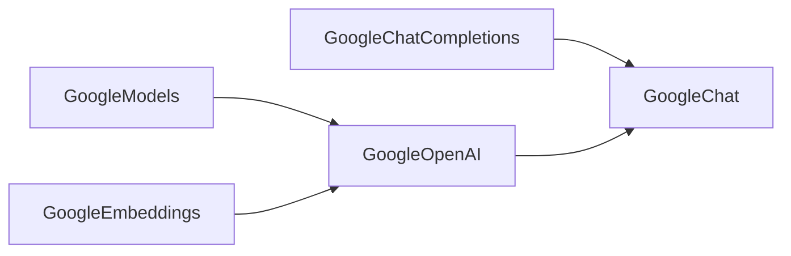

# Google

## Overview of `languru.openai_plugins.clients.google` Module

The `languru.openai_plugins.clients.google` module is designed to integrate Google's GenAI capabilities with the OpenAI framework. It provides functionalities for chat completions, embeddings, and model management.

### Module Structure



### Classes and Methods

#### GoogleChatCompletions

* **Class Description**: This class handles chat completion tasks using Google GenAI.
* **Methods**:
    * `create`: Creates a chat completion.
    * `_create`: Internal method for creating a chat completion.
    * `_create_stream`: Internal method for creating a chat completion stream.
    * `generator_generate_content_chunks`: Generates chat completion response in chunks.

#### GoogleModels

* **Class Description**: This class manages models for Google GenAI.
* **Methods**:
    * `retrieve`: Retrieves a model.
    * `list`: Lists available models.

#### GoogleEmbeddings

* **Class Description**: This class handles embedding tasks using Google GenAI.
* **Methods**:
    * `create`: Creates an embedding.

#### GoogleOpenAI

* **Class Description**: This class serves as the main entry point for Google GenAI integration with OpenAI.
* **Methods**:
    * `__init__`: Initializes the GoogleOpenAI instance.

### Usage Examples

```python
# Initialize GoogleOpenAI
google_openai = GoogleOpenAI(api_key="YOUR_API_KEY")

# Create a chat completion
completion = google_openai.chat.completions.create(
    messages=[{"role": "user", "content": "Hello"}],
    model="YOUR_MODEL_NAME"
)

# Retrieve a model
model = google_openai.models.retrieve(model="YOUR_MODEL_NAME")

# Create an embedding
embedding = google_openai.embeddings.create(
    input="YOUR_INPUT_TEXT",
    model="YOUR_MODEL_NAME"
)
```

### Troubleshooting

* **CredentialsNotProvided**: Make sure to provide a valid Google GenAI API key.
* **GoogleNotFound**: Check if the model or resource exists.

### Conclusion

The `languru.openai_plugins.clients.google` module provides a comprehensive integration of Google GenAI with OpenAI. By following this documentation, you can effectively utilize the module's functionalities for chat completions, embeddings, and model management.
