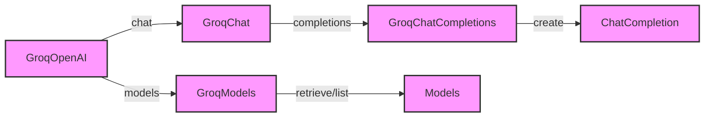

# Groq

## Introduction

The `languru.openai_plugins.clients.groq` module is designed to integrate with the Groq AI platform, providing functionalities for chat completions and model management. This documentation aims to provide a clear and concise overview of the module's capabilities and usage.

## Module Overview

The module consists of several classes and functions that facilitate interaction with the Groq AI platform. The main components include:

- **GroqChatCompletions**: Handles chat completion requests, both synchronous and asynchronous (streaming).
- **GroqModels**: Manages model retrieval and listing.
- **GroqOpenAI**: The base class that encapsulates the Groq client and provides access to chat and model functionalities.

### GroqChatCompletions

#### Methods

- **create**: Creates a chat completion. This method can operate in both synchronous and asynchronous modes depending on the `stream` parameter.
    - **Parameters**:
        - `messages`: An iterable of `ChatCompletionMessageParam` objects.
        - `model`: The model to use, specified as a string or `ChatModel` object.
        - `stream`: A boolean indicating whether to use streaming (asynchronous) mode.
        - Additional parameters for fine-tuning the completion, such as `frequency_penalty`, `logit_bias`, `max_tokens`, etc.
    - **Returns**: A `ChatCompletion` object in synchronous mode or a `Stream[ChatCompletionChunk]` in asynchronous mode.

### GroqModels

#### Methods

- **retrieve**: Retrieves a specific model.
    - **Parameters**:
        - `model`: The ID of the model to retrieve.
    - **Returns**: A `Model` object.
- **list**: Lists available models.
    - **Returns**: A `SyncPage[Model]` object containing a list of models.

### GroqOpenAI

#### Initialization

- ****init****: Initializes the GroqOpenAI client.
    - **Parameters**:
        - `api_key`: The API key for the Groq platform.
        - Additional keyword arguments for client configuration.

## Usage Examples

### Creating a Chat Completion

```python
from languru.openai_plugins.clients.groq import GroqOpenAI

# Initialize the client
client = GroqOpenAI(api_key="your_api_key")

# Create a chat completion
completion = client.chat.completions.create(
    messages=[{"role": "user", "content": "Hello, how are you?"}],
    model="groq-1",
    stream=False
)

print(completion)
```

### Listing Models

```python
from languru.openai_plugins.clients.groq import GroqOpenAI

# Initialize the client
client = GroqOpenAI(api_key="your_api_key")

# List models
models = client.models.list()

for model in models.data:
    print(model.id)
```

## Visual Overview



## Conclusion

The `languru.openai_plugins.clients.groq` module provides a robust interface for interacting with the Groq AI platform, enabling developers to create chat completions and manage models efficiently. This documentation aims to provide a quick and comprehensive guide to using the module, ensuring that developers can integrate its functionalities into their applications with ease.
