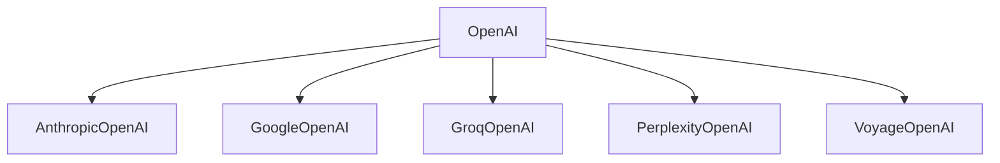

# `languru.openai_plugins.clients` Module Documentation

## Overview

The `languru.openai_plugins.clients` module provides a set of client implementations for various AI service providers, offering OpenAI-compatible interfaces. This module enables seamless integration with different AI services while maintaining a consistent API.

## Supported Clients

- AnthropicOpenAI
- GoogleOpenAI
- GroqOpenAI
- PerplexityOpenAI
- VoyageOpenAI

## Architecture



## Key Features

1. **Unified Interface**: All clients extend the base OpenAI client, providing a consistent API across different providers.
2. **Customized Implementations**: Each client adapts the OpenAI interface to the specific requirements of its respective AI service.
3. **Flexible Configuration**: Clients support various initialization parameters, including API keys and custom settings.

## Usage Example

```python
from languru.openai_plugins.clients import AnthropicOpenAI

client = AnthropicOpenAI(api_key="your_api_key_here")
response = client.chat.completions.create(
    model="claude-2",
    messages=[{"role": "user", "content": "Hello, how are you?"}]
)
print(response.choices.message.content)
```

## Client-Specific Notes

### AnthropicOpenAI

- Implements Anthropic's API with OpenAI-compatible interfaces.
- Supports streaming responses.

### GoogleOpenAI

- Adapts Google's GenerativeAI API to the OpenAI interface.
- Includes support for embeddings.

### GroqOpenAI

- Provides an OpenAI-compatible interface for Groq's API.
- Implements both streaming and non-streaming chat completions.

### PerplexityOpenAI

- Offers a minimal OpenAI-compatible interface for Perplexity AI.
- Focuses on model listing and retrieval.

### VoyageOpenAI

- Implements OpenAI-compatible embeddings for Voyage AI.
- Supports various Voyage-specific embedding models.

## Error Handling

Clients implement custom error handling to map provider-specific errors to OpenAI-compatible exceptions, ensuring consistent error management across different services.

## Conclusion

The `languru.openai_plugins.clients` module simplifies integration with multiple AI services by providing a unified, OpenAI-compatible interface. This approach allows developers to easily switch between different AI providers while maintaining consistent code structure and API usage.
