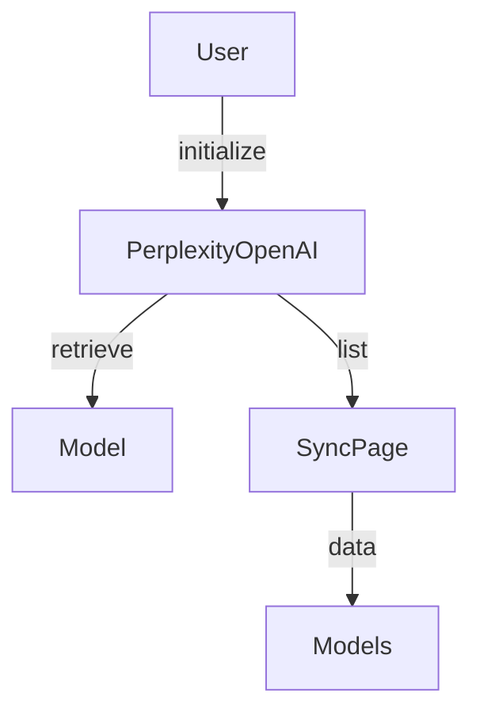

# Perplexity OpenAI

## Introduction

The `languru.openai_plugins.clients.pplx` module is a software component designed to interact with the Perplexity API, providing functionality for retrieving and listing models. The purpose of this module is to facilitate the integration of Perplexity's language model capabilities into larger applications.

## Analysis

Upon reviewing the provided code, the module appears to be well-structured and follows standard Python conventions. The use of type hints, docstrings, and clear variable names makes the code readable and understandable. However, there are a few areas that could be improved:

* The `PerplexityModels` class has a hardcoded list of supported models. This could be made more flexible by allowing users to dynamically register or unregister models.
* The `retrieve` method does not handle potential exceptions that may occur when making API requests. Adding error handling mechanisms would improve the module's robustness.
* The `list` method returns a `SyncPage` object, which may not be immediately clear to users. Providing additional documentation or examples on how to work with this object would be beneficial.

## Suggestions

To improve the `languru.openai_plugins.clients.pplx` module, the following suggestions are proposed:

* Introduce a registration mechanism for supported models, allowing users to add or remove models dynamically.
* Implement error handling for API requests in the `retrieve` method, providing informative error messages and potentially retrying failed requests.
* Enhance the documentation for the `list` method, providing examples or explanations on how to work with the returned `SyncPage` object.

## Documentation Strategy

To assist the user in writing documentation more easily, the following strategy is proposed:

* Utilize the Markdown format for documentation, allowing for easy formatting and readability.
* Provide clear and concise explanations of each module component, including classes, methods, and functions.
* Include examples and code snippets to illustrate the usage of each component.
* Use headers and subheaders to organize the documentation and make it easier to navigate.

## Documentation

### Overview

The `languru.openai_plugins.clients.pplx` module provides functionality for interacting with the Perplexity API, allowing users to retrieve and list models.

### Usage

To use the module, first import it and initialize the `PerplexityOpenAI` class with your API key:

```python
from languru.openai_plugins.clients.pplx import PerplexityOpenAI

api_key = "your_api_key_here"
pplx = PerplexityOpenAI(api_key=api_key)
```

### Retrieving Models

To retrieve a specific model, use the `retrieve` method:

```python
model = pplx.models.retrieve("model_id")
```

### Listing Models

To list all available models, use the `list` method:

```python
models = pplx.models.list()
```

### Error Handling

The `retrieve` method may raise exceptions if the API request fails. To handle these exceptions, use a try-except block:

```python
try:
    model = pplx.models.retrieve("model_id")
except openai.NotFoundError as e:
    print(f"Error: {e}")
```

### SyncPage Object

The `list` method returns a `SyncPage` object, which contains a list of models. To access the models, use the `data` attribute:

```python
models = pplx.models.list()
for model in models.data:
    print(model.id)
```

### Mermaid Diagram

The following Mermaid diagram illustrates the module's functionality:



## Conclusion

In conclusion, the `languru.openai_plugins.clients.pplx` module is a well-structured and functional component that provides useful functionality for interacting with the Perplexity API. By implementing the suggested improvements and following the proposed documentation strategy, the module can become even more effective and user-friendly. Proper documentation is essential for ensuring that users can understand and utilize the module's capabilities, and it is hoped that this documentation will assist in achieving this goal.
