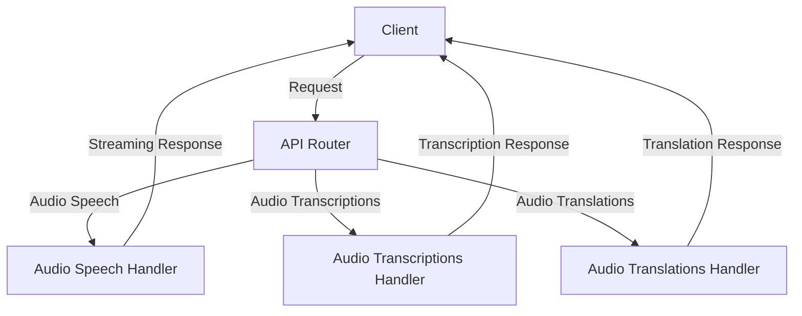

# Audio API

## Introduction

The `languru.server.api.v1.audio` module provides RESTful API routers for application use, specifically handling audio-related requests and responses. This documentation aims to provide a clear and concise guide on how to use these APIs effectively.

## API Endpoints

### Audio Speech

#### POST /audio/speech

This endpoint generates audio speech based on the provided request.

**Request Body**

* `model`: The model to use for speech generation.
* `voice`: The voice to use for speech generation.
* `input`: The text to generate speech for.

**Response**

* A streaming response containing the generated audio speech.

**Example**

```bash
curl -X POST \
  http://localhost:8000/audio/speech \
  -H 'Content-Type: application/json' \
  -d '{"model": "tts-1", "voice": "alloy", "input": "The quick brown fox jumped over the lazy dog."}'
```

### Audio Transcriptions

#### POST /audio/transcriptions

This endpoint generates transcriptions for the provided audio file.

**Request Body**

* `file`: The audio file to transcribe.
* `language`: The language of the audio file.
* `prompt`: The prompt to use for transcription.
* `response_format`: The format of the transcription response.
* `temperature`: The temperature to use for transcription.
* `timestamp_granularities`: The timestamp granularities to use for transcription.
* `timeout`: The timeout for transcription.

**Response**

* A transcription object containing the transcribed text.

**Example**

```bash
curl -X POST \
  http://localhost:8000/audio/transcriptions \
  -H 'Content-Type: multipart/form-data' \
  -F 'file=@audio_file.wav' \
  -F 'language=en' \
  -F 'prompt=Hello, world!' \
  -F 'response_format=json' \
  -F 'temperature=0.5' \
  -F 'timestamp_granularities=seconds' \
  -F 'timeout=30'
```

### Audio Translations

#### POST /audio/translations

This endpoint generates translations for the provided audio file.

**Request Body**

* `file`: The audio file to translate.
* `language`: The language of the audio file.
* `prompt`: The prompt to use for translation.
* `response_format`: The format of the translation response.
* `temperature`: The temperature to use for translation.
* `timeout`: The timeout for translation.

**Response**

* A translation object containing the translated text.

**Example**

```bash
curl -X POST \
  http://localhost:8000/audio/translations \
  -H 'Content-Type: multipart/form-data' \
  -F 'file=@audio_file.wav' \
  -F 'language=en' \
  -F 'prompt=Hello, world!' \
  -F 'response_format=json' \
  -F 'temperature=0.5' \
  -F 'timeout=30'
```

## Flowchart



## Conclusion

The `languru.server.api.v1.audio` module provides a set of RESTful API routers for handling audio-related requests and responses. This documentation aims to provide a clear and concise guide on how to use these APIs effectively. By following this guide, developers can easily integrate the `languru.server.api.v1.audio` module into their applications and utilize its features.
