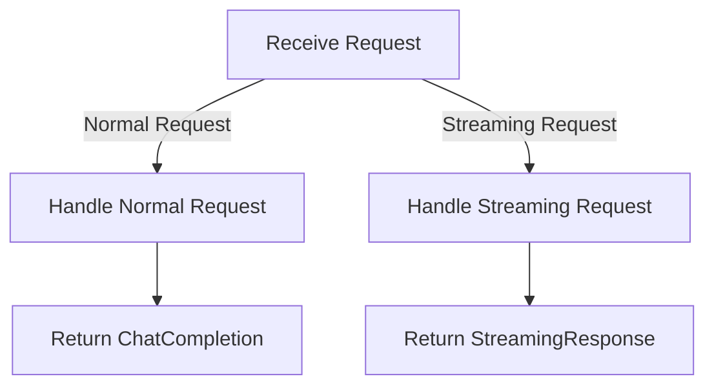

# Chat API

## Introduction

The `languru.server.api.v1.chat` module provides RESTful API routers for handling chat-related functionalities, specifically focusing on chat completions. This documentation aims to provide a clear and concise guide on how to use the module's APIs effectively.

## Module Overview

The `languru.server.api.v1.chat` module is designed to handle chat completion requests. It utilizes the OpenAI client to generate responses based on the provided chat completion requests. The module supports both normal and streaming chat completion requests.

### Key Features

- **Normal Chat Completion:** Handles standard chat completion requests, returning a complete response.
- **Streaming Chat Completion:** Supports streaming chat completion requests, providing a continuous stream of responses.

## API Endpoints

### `/chat/completions`

This endpoint handles chat completion requests. It accepts a `ChatCompletionRequest` object and returns a `ChatCompletion` or `StreamingResponse` based on the request type.

#### Request Body

```json
{
    "model": "string",
    "prompt": "string",
    "max_tokens": "integer",
    "temperature": "number",
    "stream": "boolean"
}
```

#### Response

- **Normal Response:** A `ChatCompletion` object containing the generated response.
- **Streaming Response:** A `StreamingResponse` object providing a continuous stream of responses.

## Usage Examples

### Normal Chat Completion Request

```bash
curl -X POST \
    http://localhost:8000/chat/completions \
    -H 'Content-Type: application/json' \
    -d '{"model": "gpt-4o-mini", "prompt": "Hello, how are you?", "max_tokens": 100, "temperature": 0.7, "stream": false}'
```

### Streaming Chat Completion Request

```bash
curl -X POST \
    http://localhost:8000/chat/completions \
    -H 'Content-Type: application/json' \
    -d '{"model": "gpt-4o-mini", "prompt": "Hello, how are you?", "max_tokens": 100, "temperature": 0.7, "stream": true}'
```

## Control Flow

The control flow of the module can be visualized as follows:



## Conclusion

The `languru.server.api.v1.chat` module provides a robust and flexible way to handle chat completion requests. By following this documentation, developers can easily integrate the module into their applications and utilize its RESTful APIs effectively.
